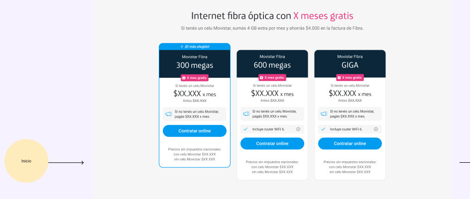

# Movistar Hyva Theme Widgets

This directory (`app/design/frontend/Movistar/hyva/Magento_Theme`) contains a collection of reusable UI components (widgets) developed for the Movistar Hyva Theme on Magento 2. The components are structured following the principles of Atomic Design, promoting modularity, reusability, and maintainability.

## Atomic Design Structure

The widgets are organized into the following categories, representing different levels of complexity in the Atomic Design methodology:

*   **Atoms**: The smallest, indivisible UI elements.
*   **Elements**: Simple components, slightly more complex than atoms, but not yet full molecules. They might combine a few atoms.
*   **Molecules**: Groups of atoms and/or elements bonded together to form a functional, reusable unit.
*   **Organisms**: Relatively complex UI components composed of molecules, atoms, and elements, forming distinct sections of an interface.

##Screenshots

###FIGMA

###Result

---

## Widgets by Category

### Atoms

Atoms are the basic building blocks of our UI. They are fundamental HTML elements or simple UI components that cannot be broken down further without losing their meaning.

*   **`link.phtml`**: A basic hyperlink component.
*   **`label.phtml`**: A simple text label.
*   **`title.phtml`**: A heading or title component.
*   **`info_card.phtml`**: A small card displaying a piece of information, likely containing a title and some text.

### Elements

Elements are slightly more complex than atoms, often combining one or more atoms to create a distinct, but still simple, UI piece.

*   **`hero.phtml`**: A hero section component, typically a large banner with a title and call to action.
*   **`slider.phtml`**: A generic slider component.
*   **`content-1.phtml`**: A basic content block.
*   **`slider-php.phtml`**: A PHP-driven slider component, likely for dynamic content.

### Molecules

Molecules are groups of atoms and/or elements assembled to form a functional, reusable unit. They perform a specific function within the UI.

*   **`faqs.phtml`**: A component for displaying Frequently Asked Questions, likely consisting of multiple question-answer pairs (atoms/elements).
*   **`loader.phtml`**: A loading spinner or indicator component.
*   **`sku_banner.phtml`**: A banner specifically designed to display SKU-related information.
*   **`featurecard.phtml`**: A card highlighting a specific feature, potentially combining an icon (atom), title (atom), and description (atom).
*   **`splitbanner.phtml`**: A banner divided into two sections, each potentially containing other atoms or elements.
*   **`benefit_card.phtml`**: A card detailing a specific benefit, similar to a feature card but focused on advantages.
*   **`product_card.phtml`**: A card displaying essential product information (e.g., image, name, price, add to cart button). This molecule is a prime example of combining multiple atoms (image, text, button) to form a functional unit.

### Organisms

Organisms are relatively complex UI components composed of molecules, atoms, and elements. They form distinct sections of an interface and represent a complete, functional part of a page.

*   **`benefits_cards.phtml`**: An organism that arranges multiple `benefit_card.phtml` molecules (and potentially other atoms/elements) into a section, often in a grid or carousel layout.
    *   **Composition Example**: This organism would typically iterate over a collection of data, rendering a `benefit_card` molecule for each item. It might also include a `title` atom for the section heading.
*   **`product_carousel.phtml`**: An organism that displays a collection of products in a carousel format.
    *   **Composition Example**: As seen in `product_carousel.phtml`, this organism utilizes:
        *   A `title.phtml` atom for the carousel's heading.
        *   Multiple instances of the `product_card.phtml` molecule to display individual products.
        *   Navigation controls (buttons, dots) which can be considered simple elements or even composed of `link.phtml` atoms and `image` elements.
        *   The overall structure and logic for carousel functionality (e.g., `x-data` for Alpine.js).

## How Organisms Utilize Lower Levels

Organisms are the highest level of component in this structure and are responsible for orchestrating and arranging molecules, elements, and atoms to create meaningful sections of a page. They act as containers and provide the layout and context for their constituent parts.

For example, the `product_carousel.phtml` organism doesn't define how a single product looks; it delegates that responsibility to the `product_card.phtml` molecule. Similarly, the `product_card.phtml` molecule doesn't define how a product name or price looks; it uses simple text atoms or styling. This hierarchical composition ensures consistency, reusability, and easier maintenance across the theme.

By adhering to this Atomic Design structure, developers can quickly understand the purpose and composition of each widget, facilitating faster development and more robust UI implementation.
